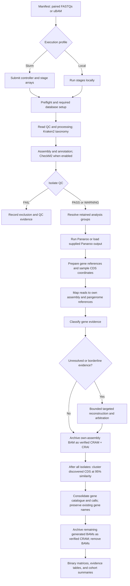
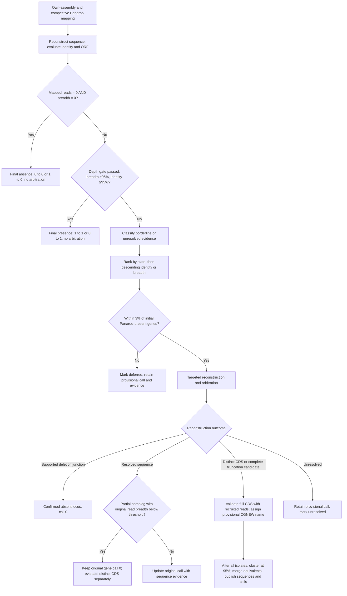
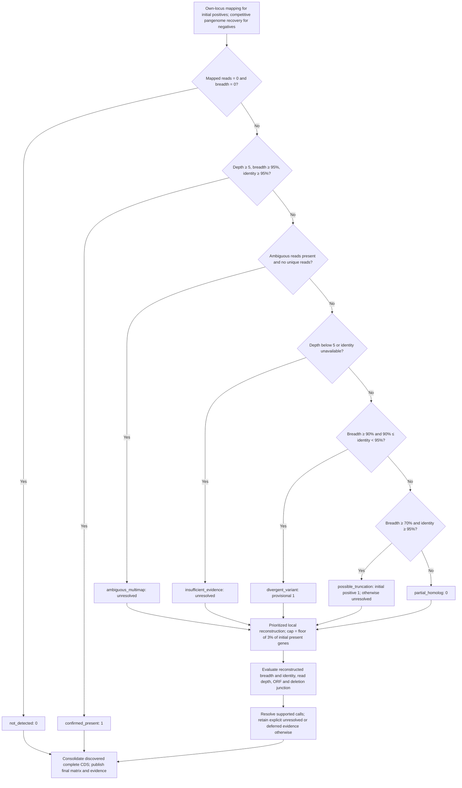

# CleanGene

**From bacterial sequencing reads to pangenomes you can inspect.**

CleanGene combines read and assembly quality control, annotation, Panaroo pangenome
construction, and read-backed gene validation. It produces a binary gene
presence/absence matrix alongside evidence that distinguishes supported genes,
partial homologs, divergent variants, ambiguous mappings, and unresolved calls.

Run cohorts through Slurm or use local execution for smaller analyses. Both modes
produce the same types of gene evidence.

| Start with | Analyze | Receive |
| --- | --- | --- |
| Paired FASTQs or unmapped BAMs | Read QC, assembly, annotation, and Panaroo | A cleaned gene presence/absence matrix |
| Existing assemblies or Panaroo results | Locus support and targeted reconstruction | Evidence tables explaining each gene call |

[Pipeline](#pipeline) · [Gene decisions](#gene-presence-and-absence-decisions) ·
[Installation](#installation) · [Quick start](#quick-start) · [Arguments](#command-line-arguments) ·
[Outputs](#outputs)

## Pipeline



The diagram shows stage dependencies. Slurm may overlap independent samples and
groups. Existing artifacts can bypass their corresponding preparation stages.

Isolates receive `PASS`, `WARNING`, or `FAIL` QC status. Warnings remain eligible
for downstream analysis; failures are excluded. QC includes taxonomy, read
quality, sequencing coverage, assembly quality, annotation success, and CheckM2
when enabled. Thresholds can be configured globally or through QC profiles and
per-isolate manifest overrides.

## Gene presence and absence decisions

Panaroo supplies the initial calls. Every tested gene undergoes competitive
mapping against Panaroo gene references and reconstructed-sequence identity/ORF
evaluation. Initial positives also use sample-specific CDS coordinates and
own-assembly read support. Missing coordinates or an unsupported own locus with
competitive read evidence use the pangenome-reference fallback.



The flowchart summarizes routing. The evidence table below defines the primary
states; arbitration can refine a provisional decision.

| Evidence state | Default interpretation | Binary treatment |
| --- | --- | --- |
| `confirmed_present` | Breadth ≥95%, identity ≥95%, and sufficient depth. | `1` |
| `divergent_variant` | Breadth ≥90%, identity ≥90% but <95%, and sufficient depth. | `1`, flagged as divergent |
| `possible_truncation` | Breadth ≥70% but <95%, identity ≥95%, and sufficient depth. | Initial positive remains provisionally `1`; otherwise unresolved |
| `partial_homolog` | Partial coverage or weak sequence similarity does not support an intact gene. | `0`, with evidence retained |
| `ambiguous_multimap` | Reads support a family but cannot resolve the exact cluster. | Unresolved; no automatic presence for every homolog |
| `not_detected` | Mapped reads = 0 and breadth = 0. | Final `0` for either initial call; no arbitration |
| `insufficient_evidence` | Depth or reconstructed identity is insufficient for a decision. | Unresolved; preserve the initial binary call unless resolved |
| `confirmed_absent_locus` | A local reconstruction supports a deletion junction spanning both flanks. | `0`, with physical absence evidence |

**Operational absence differs from a demonstrated deletion.** Zero unique
mappings alone do not imply absence when ambiguous mappings remain. Unresolved validated
calls can be blank in the evidence table. When no resolved replacement exists,
the binary matrix preserves the initial call; consult the evidence table when
interpreting that value. `partial_homolog` and `confirmed_absent_locus` both permit
an intact-gene call of zero but describe different biology.

Identity is measured from reconstructed sequence rather than average read
alignment identity. Own-locus identity uses the sample CDS as its reference;
recovery uses the pangenome reference. Normalized depth is gene depth divided by
a representative sample depth estimate and is supporting evidence, not a universal
presence threshold.

Arbitration is capped at `floor(0.03 × initial Panaroo-present genes)` per isolate,
including Panaroo-present genes outside a restricted validation scope. This is
zero cases below 34 present genes. Priority is `divergent_variant` (highest identity
first), `possible_truncation`, `partial_homolog`, then `insufficient_evidence`
(highest breadth first within each state). Ambiguous family assignments follow
those categories. Cases beyond the cap retain explicit `deferred_limit` status.

Discovery requires a complete, target-overlapping Prodigal CDS, an intact start/stop
ORF, and recruited-read support meeting the depth gate, 95% breadth and 95% identity.
New CDS receive content-derived `CGNEW_…` names. After all isolates finish,
CD-HIT-EST clusters discoveries at 95% nucleotide identity and 95% reciprocal
coverage; equivalent existing genes retain their Panaroo names. The consolidated
catalogue and presence/absence matrix include genuinely distinct discoveries.
This rebuilds the sequence catalogue and call matrix; the original Panaroo graph
remains an input artifact. New genes have supported `1` calls in discovery isolates;
other isolates have `new_gene_not_tested` evidence and binary `0` placeholders,
which must not be interpreted as demonstrated absence. No extra all-isolate
mapping pass is implied by consolidation.

## Installation

Requirements: Linux, Git, and a working Miniforge/Mambaforge installation providing
`mamba`. Slurm is required only for the Slurm execution profile.

```bash
git clone https://github.com/AndriyPlakhotnyk/CleanGene.git
cd CleanGene
bash scripts/install_or_update.sh
conda activate cleangene
```

The installer creates or updates the bioinformatics environments, installs
CleanGene from the checkout, and verifies its tools. CheckM2 runs through an
automatically managed companion environment. Installing the Python package alone
with `pip` does not install the external bioinformatics tools.

The installer checks Shovill dependencies and CheckM2 bundled test genomes. It
automatically selects local deployment checks when `sbatch` is unavailable; use
`--profile slurm` on ARC or `--profile local` on a workstation to select explicitly.
For an isolated installation, add `--env-root /path/to/environments`; both Conda
environments will be placed there. `cleangene doctor` also accepts `--profile local`.

To update your current branch:

```bash
git pull --ff-only
bash scripts/install_or_update.sh
conda activate cleangene
```

## Quick start

### 1. Configure the run

The installer creates `config/cleangene.arc.local.env` from the supplied Slurm
template without overwriting an existing local file. Set `SLURM_ACCOUNT` and
`SLURM_PARTITION` for your cluster, and adjust resource requests as needed.

```bash
cleangene doctor --config config/cleangene.arc.local.env
```

Managed databases are downloaded when needed and reused. Set
`CLEANGENE_DATABASE_ROOT` to place them on a shared filesystem; use `KRAKEN2_DB`
or `CHECKM2_DB` to select an existing database explicitly.

CheckM2 downloads the database version declared compatible by its installed
release. Interrupted downloads resume from `.download/`; the archive checksum and
the installed CheckM2 release's database SHA-256 must pass before the database is
published. Completed databases are reused. A one-time runtime test verifies the
models, database and production prediction command before preprocessing. CheckM2
uses its companion environment's DIAMOND and Prodigal executables. The pinned
[CheckM2 1.1.0 release](https://github.com/chklovski/CheckM2/releases/tag/1.1.0)
requires database version 3. Updating an environment does not repeatedly download
an already compatible database. CleanGene records the verified executable,
environment and database signature in the shared database marker; subsequent
starts reuse that marker without running `checkm2 predict --help`. The default
`CHECKM2_PREDICT_CLEANUP_OPTION=--remove_intermediates` is validated by the
production smoke test, avoiding a fragile help probe on busy Slurm nodes.

### 2. Prepare a manifest

Use a tab-separated file with one row per isolate. The example below contains
paired FASTQ paths and an explicit analysis group:

```tsv
isolate_id	group_id	R1	R2
isolate_01	species_A	/data/isolate_01_R1.fastq.gz	/data/isolate_01_R2.fastq.gz
isolate_02	species_A	/data/isolate_02_R1.fastq.gz	/data/isolate_02_R2.fastq.gz
```

Use groups of biologically comparable isolates. Pangenome analysis requires at
least two retained isolates per group.

| Column | Purpose |
| --- | --- |
| `isolate_id` | Unique sample identifier. |
| `R1`, `R2` | Paired FASTQ inputs; compressed FASTQs are supported. |
| `raw_bam` | Alternative to `R1`/`R2`: a paired, unmapped sequencing BAM containing both mates. |
| `group_id` | Explicit pangenome group. |
| `organism` | Defines the group when `group_id` is absent. Without either field, Kraken2 determines grouping. |
| `assembly`, `gff` | Reusable assembly and annotation artifacts. |
| `pangenome_dir` | Existing Panaroo output to use instead of generating a new pangenome. |

Provide either paired FASTQs or a uBAM for each isolate. Optional reuse fields
include `reads_processed`, `fastp_json`, `kraken_report`, `protein_fasta`, and
`checkm2_report`.

### 3. Launch

```bash
cleangene run \
  --profile slurm \
  --manifest input/cohort.manifest.tsv \
  --analysis-root /data/cleangene-analysis \
  --config config/cleangene.arc.local.env \
  --assembler spades
```

This submits a controller job and returns to the shell. Add `--ignore-checkm2`
to omit CheckM2 completeness and contamination assessment. Other QC criteria
remain active.

For a small local analysis, use `--profile local`. For a Slurm submission preview,
add `--dry-run`; it creates run metadata and prints the controller submission
command without submitting jobs. Local `--dry-run` prints the planned stage sequence and returns before
preflight or processing.

## Command-line arguments

Local runs default to the active CleanGene checkout for outputs. To use all
processing defaults except downsampling:

```bash
cleangene run --manifest input/example.manifest.tsv --skip-downsampling
```

Run `cleangene run --help` for the complete CLI reference. Configuration values
apply unless overridden by a command-line option.

| Argument | Values / default | Purpose |
| --- | --- | --- |
| `--manifest` | TSV path | Sample inputs; required for a new run. |
| `--analysis-root` | Active CleanGene checkout | Parent directory for `runs/<run-id>/`; standalone installations without a checkout use the current directory. |
| `--config` | Environment-style file | QC, database, and execution settings. |
| `--profile` | `local` (default), `slurm` | Execution backend for `run` and `doctor`; ARC submissions must specify `--profile slurm`. |
| `--skip-downsampling` | Flag; off by default | Run Shovill with `--depth 0`: retain KMC genome-size estimation and other processing, without read-depth reduction. |
| `--assembler` | `shovill` (built-in default), `spades`, `off` | Assembly strategy; `off` skips assembly and annotation. |
| `--ignore-checkm2` | Flag | Skip CheckM2 assessment during the run. |
| `--skip-trim` | Flag | Bypass fastp trimming. |
| `--compress-assembly-outputs` | `off`, `intermediates`, `all` | Assembly storage policy; built-in default is `intermediates`. |
| `--compress-annotation-outputs` | `off`, `nonessential` | Annotation storage policy; built-in default is `nonessential`. |
| `--cleanup-trimmed-fastq` | Flag | Enable final cleanup of retained trimmed FASTQs. |
| `--run-id` | Identifier | Set a run name instead of the generated timestamp. |
| `--resume` | Existing run ID | Resume a run under the analysis root. |
| `--dry-run` | Flag | Preview local stages or Slurm submission without execution. |
| `--cancel-active` | Flag, resume | Cancel active jobs associated with the run before resubmission. |

Assembly intermediates and nonessential annotation outputs are compressed by
default; the primary assembly and GFF remain available. Explicit `off` settings
in existing configs still override these defaults. To adopt the new policy in
an existing local config, set `COMPRESS_ASSEMBLY_OUTPUTS="intermediates"` and
`COMPRESS_ANNOTATION_OUTPUTS="nonessential"`.

Direct SPAdes mode uses original paired reads with `--only-assembler`. Choose
Shovill when you want its assembly preparation workflow. `SHOVILL_MEMORY_GB`
(default `16`, minimum `8` for the pinned release) is passed as Shovill's `--ram`
limit; keep it within the preprocessing job's memory allocation. The environment
pins tested Shovill 1.4.2 and SPAdes 3.x compatibility.

### Validation decision flow

The flow below follows the first matching read-evidence rule in
[`classify_gene_evidence`](src/cleangene/evidence.py). Values shown are defaults;
configured thresholds apply. Breadth is the fraction of reference bases covered,
identity comes from reconstructed sequence, and mean depth is measured in reads.



A supported deletion junction requires ≥95% identity and ≥50 aligned bases on
both flanks. New complete CDS require an intact ORF plus ≥95% read breadth,
≥95% identity and the depth gate. Unresolved calls without a replacement retain
the initial binary value. Normalized depth is supporting context, not a universal
presence gate. See the evidence states above for interpretation and exceptions.

### Validation settings

Set these in your config file. Breadth and identity thresholds use fractions
between zero and one, not percentages.

| Setting | Built-in default | Purpose |
| --- | --- | --- |
| `VALIDATION_SCOPE` | `all` | Validate all genes; `accessory` and `differential` restrict selection. |
| `READ_VALIDATION_MIN_BREADTH` | `0.95` | Confirmed-presence breadth. |
| `READ_VALIDATION_MIN_IDENTITY` | `0.95` | Confirmed-presence sequence identity. |
| `READ_VALIDATION_MIN_MEAN_DEPTH` | `5` | Minimum mean depth for sequence-based calls. |
| `READ_VALIDATION_MIN_MAPQ` | `20` | High-confidence mapping threshold. |
| `READ_VALIDATION_TRUNCATION_MIN_BREADTH` | `0.70` | Lower breadth threshold for possible truncation. |
| `READ_VALIDATION_DIVERGENT_MIN_BREADTH` | `0.90` | Minimum divergent-variant breadth. |
| `READ_VALIDATION_DIVERGENT_MIN_IDENTITY` | `0.90` | Minimum divergent-variant identity. |
| `READ_VALIDATION_ARBITRATION_FRACTION` | `0.03` | Fraction of initial Panaroo-present genes permitted arbitration, rounded down. |
| `NOVEL_GENE_CLUSTER_IDENTITY` | `0.95` | Global nucleotide identity for discovery consolidation. |
| `NOVEL_GENE_CLUSTER_COVERAGE` | `0.95` | Required alignment coverage of both sequences. |
| `READ_VALIDATION_ARBITRATION_MAX_READS` | `100000` | Maximum recruited read names per reconstruction. |
| `READ_VALIDATION_ARBITRATION_MEMORY_GB` | `12` | SPAdes memory cap for reconstruction. |
| `READ_VALIDATION_FLANK_LENGTH` | `500` | Flanking bases used for locus investigation. |
| `READ_VALIDATION_DELETION_MIN_IDENTITY` | `0.95` | Minimum junction sequence identity. |
| `READ_VALIDATION_DELETION_MIN_ANCHOR` | `50` | Contiguous aligned bases on each side of the junction. |

The legacy `READ_VALIDATION_ARBITRATION_MAX_CASES` setting is superseded by the
fraction and no longer controls arbitration.

### Developer diagnostics

`DEVELOPER_MODE=true` is enabled by default. Each preprocess worker records
start/end timestamps for read preparation, Kraken2, assembly, CheckM2, and
Prokka in `logs/developer_preprocess.tsv`, and stores total elapsed seconds in
its completion marker. The timing file's `source` column identifies worker
wall-clock measurements. Controller updates include a `sources` field that
identifies the source of every reported number.

Controller update fields:

| Field | Meaning | Number source |
| --- | --- | --- |
| `user_jobs` | Jobs currently counted for the user, shown against the configured limit. | Slurm user queue snapshot. |
| `total_submitted` | Isolate or group tasks submitted or already recognized as done for this stage. | Controller submission and done sets. |
| `total_completed` | Tasks with successful completion markers. | `state/<stage>/*.done.json`. |
| `samples_completed` | Samples in the run with successful preprocessing markers; this remains useful while later group stages are running. | `state/preprocess/*.done.json`. |
| `step_completed` | Completed tasks divided by the current stage task count. | Successful markers and the stage task list. |
| `running` | Tasks in running Slurm states for this stage. | Slurm stage job states. |
| `slurm_pending` | Tasks waiting in pending or unknown Slurm states for this stage. | Slurm stage job states. |
| `not_submitted_yet` | Stage tasks not yet submitted or completed. | Stage total minus controller-submitted tasks. |
| `failed` | Tasks with failed completion markers. | `state/<stage>/*.done.json` with `status=failed`. |

Developer update fields:

| Field | Meaning | Number source |
| --- | --- | --- |
| `avg_completion` | Arithmetic mean of completed preprocess durations, formatted as `HH:MM:SS`. | `state/preprocess/<isolate>.done.json:preprocess_elapsed_seconds`. |
| `n_samples` | Number of completed preprocess samples contributing a duration. | Same completion-marker fields. |
| `running` / `done` | Current preprocess tasks running and completed. | Slurm preprocess states and successful markers. |
| `total` | Total samples in the run, including submitted and previously completed samples. | `state/isolate_tasks.tsv`. |
| `samples_completed` | Successful preprocess samples in the run at report time. | `state/preprocess/*.done.json`. |

Controller progress updates are emitted every two minutes by default while the
controller continues polling and refilling work every `SLURM_POLL_SECONDS`.
`SLURM_CONTROLLER_REPORT_INTERVAL_SECONDS` changes the reporting interval.
Set `DEVELOPER_MODE=false` to suppress per-step timing files and periodic
developer reports. `DEVELOPER_REPORT_INTERVAL_SECONDS` controls the developer
report interval (default 1800 seconds).

After the summary stage, developer mode writes `logs/developer_final_report/`.
`stage_runtime.tsv` reports observed task counts, cumulative worker time, task
min/mean/max, and the elapsed span for each stage. `process_runtime.tsv` groups
preprocessing substeps and smaller preflight, launcher, and CheckM2 timing files.
`README.txt` records the run sample count and controller wall-clock time. Array
stage cumulative worker time can exceed wall-clock time because tasks overlap.

Use `SLURM_PREPROCESS_MAX_INFLIGHT`, `SLURM_VALIDATION_MAX_INFLIGHT`, and
`SLURM_ARBITRATION_MAX_INFLIGHT` to control concurrency. Stage-specific CPU,
memory, and time requests are available in the
[Slurm configuration template](config/cleangene.arc.env). The
[example config](config/cleangene.example.env) and
[default settings](src/cleangene/defaults.py) list additional controls, including
QC thresholds and database management.

## Outputs

Each run is stored beneath `<analysis-root>/runs/<run-id>/`.

| Location within a run | Contents |
| --- | --- |
| `results/groups/<group>/cleaned_pangenome.tsv` | Final binary gene presence/absence matrix. |
| `results/groups/<group>/03_read_validation/gene_call_evidence.long.tsv` | Initial/final calls, evidence states, resolution, and arbitration details. |
| `results/groups/<group>/03_read_validation/read_validation_metrics.tsv` | Coverage, depth, normalized depth, identity, reconstruction lengths, mappings, and CDS coordinates. |
| `results/sample_data/<isolate>/` | Per-isolate QC and processing artifacts. |
| `results/cohort/` | Cohort QC and summaries. |
| `provenance/` | Manifest, resolved configuration, and runtime metadata. |
| `logs/slurm/` | Controller and stage job logs. |

Each group's `04_summary/` contains `pangenome_presence_absence_before_validation`
and `pangenome_presence_absence_after_validation`, both as PNG and SVG. The before
plot uses the original Panaroo binary matrix; the after plot uses final validated
calls, including discovered genes and provisional values. Each plot independently
sorts genes by prevalence and clusters isolates, so positions are not paired
between panels. The original `pangenome_presence_absence.png`/`.svg` names remain
copies of the after plot. Resume backfills missing plots on local and Slurm runs
without repeating mapping or arbitration solely for these figures.

### Validation summaries

Each group's `03_read_validation/` directory also contains:

| File | Contents |
| --- | --- |
| `gene_call_summary.tsv` | Group totals: all calls, kept, changed, 0→1, 1→0, initial/final presence counts, and percentages. |
| `gene_call_summary.per_isolate.tsv` | The same counts and percentages for every retained isolate. |
| `summary_statistics.txt` | Reconciled final-matrix statistics, including core, soft-core, shell, cloud, and absent-in-all clusters. |
| `decision_reason_upset.png`, `.svg` | UpSet-style plot: decision reasons across columns, change direction as color, and deciding metrics in the bottom matrix. |
| `decision_reason_upset.tsv` | Exact counts, metric membership, and provenance used to draw the plot. |

“Kept” means an unchanged call, including both 0→0 and 1→1. An isolate's percentage
denominator is **all gene clusters in its group's matrix**, including untested
calls carried forward. Cohort totals count gene-isolate calls across groups;
percentages are weighted by those counts. Cohort tables and the combined plot are
written to `results/cohort/`, including `gene_call_summary.per_group.tsv`.

The text report is published only after initial/final matrices and evidence
agree, kept + changed equals total calls, and both change directions reconcile.
Its prevalence bins are recalculated from final calls; provisional calls remain
part of the binary matrix. Cloud counts include clusters absent from all retained
isolates, which are also listed separately.

Plot dots mean **metrics used by the deciding rule**, not thresholds passed.
New evidence records `decision_metrics`; older evidence uses labeled state-based
inference. Reasons with different metric sets appear in separate columns. Reports
with more than 30 columns have additional numbered pages; no decisions are omitted.
A run with no changed calls receives an explicit “No gene calls changed” plot.
Resume backfills missing reports using existing validation evidence, without
rerunning mapping or arbitration solely for reporting.

Keep the evidence tables with the binary matrix. They identify provisional calls,
family-only evidence, partial homologs, and supported deletions that a binary value
cannot express.

## Resume and monitor

```bash
cleangene resume \
  --run-dir /data/cleangene-analysis/runs/<run-id> \
  --config config/cleangene.arc.local.env
```

Completed work is reused where its completion checks pass. Resume reconciles
preprocessing outputs and reruns incomplete or invalidated stages. For local
resumption, use `cleangene run --profile local --analysis-root ... --resume <run-id>`.
Use a new run when changing biological thresholds.

Monitor Slurm jobs with `squeue -j <job-id>` and inspect the run's controller and
stage logs. To audit missing preprocessing completion markers:

```bash
cleangene reconcile-preprocess --run-dir /data/cleangene-analysis/runs/<run-id>
```

## Downstream analysis

`cleangene utils` provides sample selection, differential gene analysis, operon
analysis, read-backed variants, iTOL exports, and post-hoc CheckM2 assessment.
See the [utilities guide](docs/UTILS.md) for commands and output descriptions.

Own-assembly alignments are archived automatically after validation/arbitration.
Each isolate retains `own_assembly_reads.cram`, its `.cram.crai` index, the exact
`own_assembly_reference.fasta`, reference/source SHA-256 metadata, and a verified
archive manifest. BAM/BAI removal occurs only after alignment-level round-trip
verification. At final summarization, remaining generated BAMs (including competitive
pangenome mappings, arbitration evidence, and compressed BAM intermediates) are
also converted and verified before deletion. These CRAMs store sequence bases
without requiring an external reference. Coordinate-sorted CRAMs receive CRAI
indexes; other sort orders are preserved without indexes. The inventory is
`results/cohort/alignment_archives.tsv`. Linked inputs and restored utility BAMs
are preserved. Competitive mapping and reconstructed identity/ORF evaluation
remain required validation steps.

A partial homolog does not establish presence of its parent gene below the
configured read-breadth threshold (default 95%), even if local reconstruction
aligns across the full reference. A separately validated complete CDS receives a
new gene name and is consolidated with other discoveries. Sequence clustering
cannot merge it back into an unsupported parent call.

```bash
cleangene-utils restore-bam --run-dir /path/to/run --all-alignments --profile slurm
cleangene-utils restore-bam --run-dir /path/to/run --organism "Species name" --samples isolate1 --profile slurm
cleangene-utils inspect-reads --run-dir /path/to/run --organism "Species name" --samples isolate1 --region contig1:1000-2000 --profile slurm
cleangene-utils evidence-msa --run-dir /path/to/run --organism "Species name" --genes geneA geneB --profile slurm
```

These commands also accept `--profile local`, and are available as
`cleangene utils <command>`. Restoration preserves the archive and verifies the
restored BAM. MSA uses archived read consensus at known CDS coordinates and
validated discovered CDS; its summary reports how many sequences were available.

Consolidated outputs in `03_read_validation/` include
`validated_gene_sequences.fasta`, `discovered_gene_aliases.tsv`, and
`discovered_gene_sources.tsv`. Summary counts include discovered rows, using
`initial_calls.with_discovered_genes.tsv` as the comparison matrix.

## Interpretation and scope

Local reconstruction is limited to unresolved or borderline cases within the arbitration cap. Exact allele resolution
among highly similar homologs can remain unresolved, and automatic transfer of
flanking loci from other isolates is not currently implemented. ORF checks are
basic; normalized depth uses an assembly-based chromosomal proxy. Cohort-scale
performance depends on reference complexity, coverage, and available resources.

## Testing

See the [codebase and verified execution baseline](docs/CODEBASE.md) for the
local end-to-end record, module organization and Slurm deployment procedure.

With the CleanGene environment active:

```bash
bash tests/run_tests.sh
```

The suite covers classification, local and Slurm orchestration, resume, QC, and
storage behavior. Synthetic-read integration tests exercise mapping, recovery,
local assembly, and deletion-junction detection when their tools are available.
The [end-to-end testing guide](docs/TESTING.md) covers a real two-isolate
Shovill/CheckM2 run and verification of completed-run reuse.

## License

See [LICENSE](LICENSE).

### ARC submission without downsampling

Keep the account and partition settings in your existing ARC configuration.
The installer updates the environment; compression defaults already retain
assembly intermediates as compressed files and compress nonessential annotation
outputs. `--skip-downsampling` affects Shovill only and keeps KMC enabled.

```bash
cd /path/to/CleanGene
git pull --ff-only origin main
bash scripts/install_or_update.sh --profile slurm
conda activate cleangene
cleangene doctor --profile slurm --config config/cleangene.arc.local.env
cleangene run \
  --profile slurm \
  --manifest "$PWD/input/arc_GDS_test.manifest.tsv" \
  --analysis-root "$PWD" \
  --config "$PWD/config/cleangene.arc.local.env" \
  --assembler shovill \
  --skip-downsampling
```

Omit the flag for normal Shovill downsampling. To disable it when resuming, add
`--skip-downsampling` to `cleangene resume`; already completed assemblies are reused.
